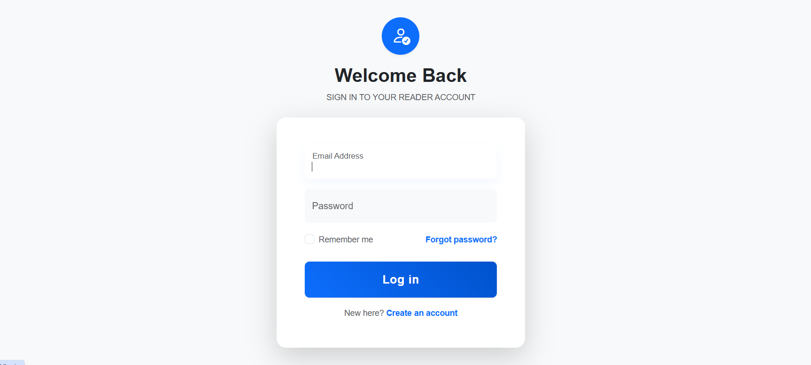
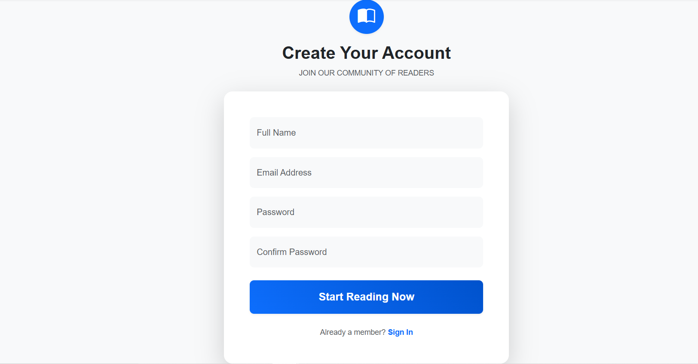

# 📚 Bookstore AI Assistant (BookBot)

**BookBot** is a high-performance bookstore management system featuring an integrated AI assistant. Built on **Laravel 12**, it leverages the **Gemini 3 Flash** model to provide real-time book recommendations, inventory inquiries, and literary guidance.

## 📸 Project Showcase

Experience the interface of **BookBot**. Below are the core user and administrative modules.

| **Login Interface** | **Account Registration** |
| --- | --- |
|  |  |
| *Secure access for users & admins* | *Quick onboarding for new customers* |

| **Customer Dashboard** | **Admin Control Panel** |
| --- | --- |
|  |  |
| *Manage profile & order history* | *Total control over inventory & users* |

---

## 🌟 Key Features

* **🤖 Smart AI Clerk:** Uses Google Gemini 3 Flash to act as a knowledgeable bookstore assistant.
* **📖 Catalog Management:** Full CRUD system for books, categories, and authors.
* **💬 Modern Chat UI:** Responsive interface with real-time status indicators and a "Clear Chat" history feature.
* **⚡ Optimized Performance:** Implements Laravel's latest caching for sub-second AI responses.
* **💾 Database Backup:** Includes a pre-configured `.sql` file for quick data restoration.

## 🛠️ Technical Stack

* **Backend:** Laravel 12.x
* **Frontend:** Blade Templates, Bootstrap 5.3, Vanilla JavaScript (Fetch API)
* **AI Engine:** Google Generative AI (`gemini-3-flash-preview`)
* **Database:** MySQL 8.0+

## 🧠 Technical Challenges & Solutions

### 1. Handling Gemini 3 Thinking Levels

**Challenge:** Early integration led to "Unknown name 'thinking_level'" errors due to strict JSON payload requirements in the REST API.
**Solution:** Refined the `generation_config` structure to properly nest the `thinking_config` parameters, ensuring compatibility with the 2026 Gemini 3 API specifications.

### 2. Stateless Conversation History

**Challenge:** Maintaining context in a web environment without bloated database calls.
**Solution:** Implemented a lightweight session-based history management system that allows the AI to "remember" the last 5 exchanges while keeping latency low.

## 🚀 Getting Started

### Prerequisites

* PHP 8.2 or higher
* Composer
* A Google AI Studio API Key

### Installation

1. **Clone the Repository**
```bash
git clone https://github.com/YOUR_USERNAME/YOUR_REPO_NAME.git
cd bookstore-chatbot

```


2. **Install Dependencies**
```bash
composer install

```


3. **Configure Environment**
```bash
cp .env.example .env
php artisan key:generate

```


*Open `.env` and set your `GEMINI_API_KEY` and local database credentials.*
4. **Database Initialization**
```bash
php artisan migrate
# Optional: Import database/backups/database.sql into your MySQL client

```


5. **Run Application**
```bash
php artisan serve

```


## 📄 License

Distributed under the MIT License. See `LICENSE.md` for more information.
